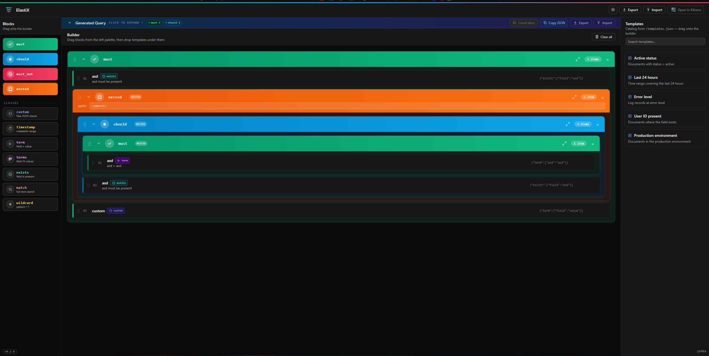

# ElastiX

> **Make complicated huge elastic query the simpliest and most clear!**



A visual builder for Elasticsearch bool queries. Drag-and-drop must / filter / should / must_not blocks, drop templates or typed clauses inside them, peek the generated JSON, optionally count matching docs against a live cluster, or jump straight into Kibana Dev Tools with the query pre-loaded.

Designed to run on fully offline machines — no CDN dependencies at runtime.


> **Note:** drop a PNG at `docs/screenshot.png` to populate the image above. A 1600–2000px wide capture of the full app (light or dark mode, with a couple of blocks built out) reads best on the GitHub repo page.

## Stack

- **React 18** + **TypeScript 5** + **Vite 5**
- **Tailwind 3** (class-based dark mode)
- **zustand 4** for state, with `persist` migrations
- **@dnd-kit** for drag-and-drop
- **Node.js** (plain `http`) for the production server

## Quick start

```bash
npm install
npm run dev          # Vite dev server on :5173
npm run build        # type-check + production bundle to ./dist
node server.js       # serves ./dist on :4000 (PORT env to override)
```

## Environment

The frontend never sees these — they're read by the dev middleware (`vite.config.ts`) and the prod server (`server.js`) via the shared module `server/elasticApi.js`.

| Var | Purpose |
|---|---|
| `ELASTIC_URL` | Elasticsearch base URL (e.g. `https://es.local:9200`). Required for the **Count docs** button. |
| `ELASTIC_USERNAME` / `ELASTIC_PASSWORD` | Basic auth credentials. |
| `ELASTIC_API_KEY` | Alternative to user/pass — base64 `id:key`. |
| `ELASTIC_INDEX` / `ELASTIC_INDEX_PATTERN` | Index pattern to count against. Default `*`. |
| `ELASTIC_INSECURE` | Set `true` to skip TLS verification (dev only). |
| `KIBANA_URL` | Kibana base URL. Required for the **Open in Kibana** button. |
| `KIBANA_DATA_VIEW_ID` | Optional Discover data-view UUID. |
| `MONGO_URL` | Optional MongoDB connection string. When set, templates are served live from Mongo via `GET /api/templates` (preferred over the static catalog). |
| `MONGO_DB` | Mongo database name. Default `elastix`. |
| `MONGO_TEMPLATES_COLLECTION` | Collection holding the templates. Default `templates`. |

Copy `.env.example` to `.env` for dev. In prod, set them on the container/pod.

## Project layout

```
src/
  App.tsx                       header, footer, drag wiring, layout
  store.ts                      zustand store + query builder
  types.ts                      BuilderSource union + MODE_META
  index.css                     Tailwind base + scrollbar + a few keyframes
  components/
    Builder.tsx                 main canvas area
    BlockCard.tsx               a must / filter / should / must_not / nested block
    BuilderRow.tsx              one leaf row inside a block
    ModeBlockPalette.tsx        left sidebar — block + clause cards
    TemplateLibrary.tsx         right sidebar — searchable templates
    QueryOutput.tsx             top bar — collapsible Generated Query
    JsonTree.tsx                read-only collapsible JSON viewer
    JsonPreviewModal.tsx        the "show full JSON" popup
    *Form.tsx                   one form per leaf clause type
  utils/
    theme.ts                    light/dark toggle + system preference
    preview.tsx                 React context for the JSON preview modal
    dateMath.ts                 ES "now-15m"-style expressions
server/
  elasticApi.js                 shared /api/config + /api/count handlers
  templatesApi.js               /api/templates — MongoDB catalog handler
server.js                       prod static server (mounts /api/*)
vite.config.ts                  dev server (mounts /api/* via the same module)
public/
  favicon.svg
  templates.json                local fallback template catalog
```

## Features

- **Block-based bool builder** — must, filter, should, must_not. Drag to reorder, drag onto another block's body to nest.
- **Nested queries** — a 5th block type with an editable `path:` that wraps its items in an ES `nested` clause.
- **Leaf clauses** — custom (free JSON), timestamp (range), term, terms, exists, match. Each has an optional title.
- **Templates** — pulled from a MongoDB collection (`MONGO_URL`), or `public/templates.json` / a ConfigMap mounted at `/etc/templates/templates.json` as fallback. Searchable. Eye button shows the JSON.
- **Generated Query view** — collapsible JSON tree with per-node toggles; copy + count docs + open-in-Kibana.
- **Dark mode** — header toggle, follows system preference until you choose, persists in localStorage.
- **Import / Export** — save the entire builder state (blocks, names, paths, titles, nested structure) as a `.elastix` file. Re-importable.
- **Offline-first** — no Google Fonts, no Monaco, no runtime CDN calls. JSON syntax highlighting is hand-rolled.

## Templates

The catalog at `public/templates.json` is the dev fallback. In production, mount your own at `/etc/templates/templates.json` (the entry script at `server.js` reads it on boot and inlines it into `index.html`).

A template is:

```json
{
  "id": "abc-123",
  "name": "Production traffic",
  "description": "envs marked prod",
  "query": { "term": { "env": "prod" } }
}
```

## Production deployment

Build the SPA, then run the static server:

```bash
npm ci
npm run build
PORT=4000 \
  ELASTIC_URL=https://es.local:9200 \
  ELASTIC_USERNAME=elastic \
  ELASTIC_PASSWORD=… \
  KIBANA_URL=https://kibana.local \
  node server.js
```

Same code path works inside a container or a K8s pod. Templates can be supplied via a mounted ConfigMap at `/etc/templates/templates.json` — no rebuild needed.

## Notes

- The zustand persist key is `eck-template-builder-v2`. Schema version lives in `store.ts` (currently v7). Cross-version migrations live in the `migrate` callback.
- The drag-and-drop collision detection in `App.tsx` has hysteresis to avoid flickering between nested drop targets — see the comment block in `collisionDetection`.
